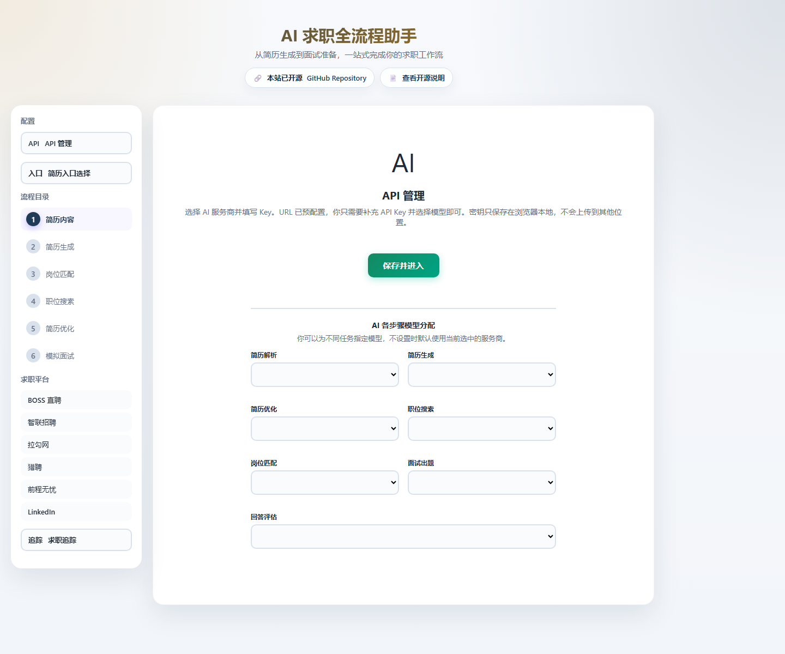
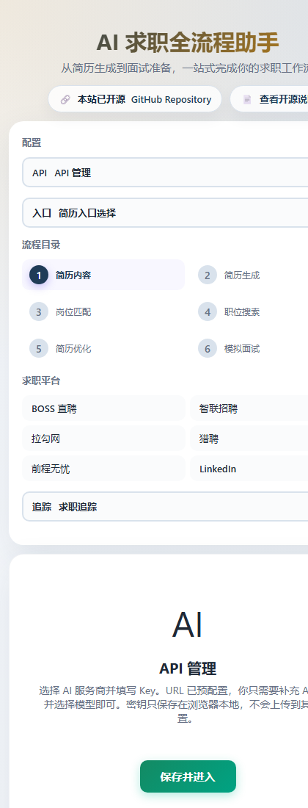

# AI Job Search Copilot

A Chinese-first AI job search workspace that connects resume preparation, role matching, job search, targeted optimization, mock interviews, and application tracking.

The repository provides two forms:

- **Web app**: a visual workflow for the complete job search process.
- **Skill suite**: reusable skills for Claude Code and Codex-style agents.

[中文说明](README.md) · [Live demo](https://interview-coach-skill.netlify.app/) · [GitHub Pages mirror](https://wksudud.github.io/interview-coach-skill/) · [Roadmap](ROADMAP.md)




## Highlights

- End-to-end flow: resume preparation, role matching, job search, optimization, interview practice, and application tracking.
- Two ways to use it: browser web app or command-line AI skills.
- Zero-backend static web app: deploy to any static host.
- Privacy-first: API keys and session data stay in browser `localStorage`.
- Chinese-first interaction and resume templates.

## Web App Capabilities

`API config → Resume collection → Resume generation → Role matching → Job search → Resume optimization → Mock interview → Application tracking`

Key capabilities:

- API presets for DeepSeek, Doubao, and Qwen OpenAI-compatible endpoints.
- Resume creation or import from pasted text.
- Multi-format material parsing: `txt`, `md`, `pdf`, `docx`, `rtf`, and `html`.
- AI resume generation with template switching and PDF/DOC/Markdown export.
- Job matching, job search simulation, company-targeted resume optimization, mock interviews, and application tracking.

## Skills

Three skills live under `.claude/skills/` and `.agents/skills/`:

- `interview-coach`: structured mock interview practice with scoring and feedback.
- `resume-builder`: resume creation and targeted optimization.
- `full-career`: end-to-end career workflow in one session.

## Quick Start

```bash
git clone https://github.com/wksudud/interview-coach-skill.git
cd interview-coach-skill
npm test
```

Start the local web app:

```bash
npm run serve
```

Then open `http://localhost:8788`. You can also use any static server with `web-app/` as the document root.

In the app, open **API Management** and add your own API key. The app does not proxy or store keys on a server.

## Tests

```bash
npm test           # local static smoke tests
npm run smoke:live # verify live Netlify and GitHub Pages URLs
```

## Project Structure

```text
.
├── README.md
├── README.en.md
├── ROADMAP.md
├── package.json
├── netlify.toml
├── .claude/skills/
├── .agents/skills/
├── tests/
├── docs/
└── web-app/
    ├── index.html
    ├── assets/
    └── templates/
```

## Privacy

- API keys are stored only in the current browser.
- Resume content, interview records, and application data stay in local session storage by default.
- Third-party model APIs receive the data you explicitly send, so review each provider's data policy before use.

## License

[MIT](LICENSE)
